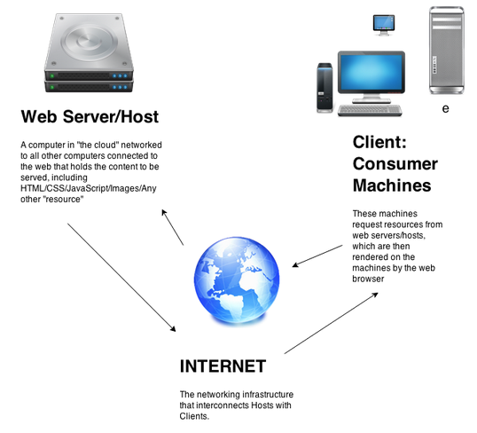
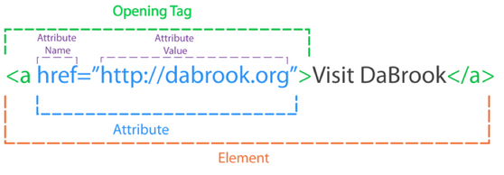
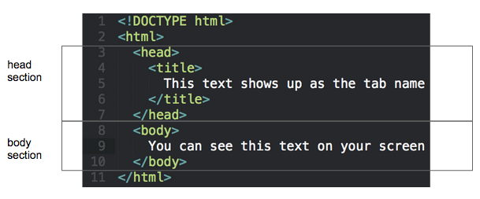
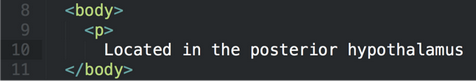

autoscale: true
footer: © New York Code + Design Academy 2016
slidenumbers: true

## Please download and install if you haven't already:

Google Chrome
[google.com/chrome](google.com/chrome)

Sublime Text
[sublimetext.com](sublimetext.com)

Atom
[atom.io](atom.io)

---

# Web Development Basics

---

# Learning Objectives

- Understand how web pages are served to the user

- Be able to name different parts of a website

- Build a basic HTML page


---

# How the Web Works




---

# Parts of a website

- HTML – content markup

- CSS - layout/styling

- JavaScript – client-side behavior

- Ruby, PHP, or Python – server-side behavior

---

# What is HTML?

- Hyper Text Markup Language

- Marks up text

- With CSS, associates style information

- HTML files contain tags and regular text

---

# Creating an HTML file

- Quick demonstration –what you see, what the browser sees

- An HTML file can be created in any plain text editor - it is a plain text file that ends in .htm or .html

- HTML files are typically edited in applications like Sublime Text 2, TextWrangler, Atom and BBEdit

---

# HTML tags

- A tag is enclosed in 2 angle brackets (<>)

- A closing tag has a / before the keyword

- For instance, ```<html>``` is the opening tag, ```</html>``` is the closing tag of the document

---

# Beware: Improper nesting
- Tags, much of the time, have other tags inside of them
- Beware of improper nesting:

```html
<strong>
  <li>
  </strong>
</li>
```
---

# HTML Attributes

- HTML elements can have attributes

- Attributes provide additional information about an element

- Attributes are always specified in the opening tag

- Attributes come in name/value pairs like: name="value"

---

# HTML Elements
## not just the tag



---

# Anatomy of a Webpage

- Doctype

  -tells the browser what HTML version you're using. For HTML5, always use:
  ```<!DOCTYPE html>```

-HTML
  - Head section - loaded first, user does not see it
  - Body section - Page content

---

# Anatomy of a Webpage



^ Open up Sublime Text, write this out and have everybody change their title

---

# The ```<head></head>``` Section

- The ```<head>``` section of your file contains more than just the title of your document

- It encloses links to external files (CSS, JavaScript, etc), accomplished using HTML elements as well

- You can also create CSS or JavaScript directly inside of this section

---

# The ```<body>``` Section

-The ```<body>``` section of your file contains everything that the user sees on their screen

-HTML tags to demarcate content, like ```<p>``` and ```<div>```, are found inside of this section as well as your content itself

-Let's meet the tags!

---

# Tags: ```<a>```

-```<a>``` is the link tag, it is used to link to other pages on the web and to other sections of the document itself

-It requires an href attribute to tell the browser where to go when the link is clicked

-The target attribute can be given a value of `_blank` to open the link in a new tab

---

# Tags: ```<a>```

```html
<a href="http://google.com">Google</a>

<a href="http://google.com" target="_blank">Google</a>
```
---

# Tags: ```<a>```

To use <a> to link to an element on another part of the page, give it the value of the element's id attribute

```html
<a href="#sometext">
  Click here to go to the text
</a>
<div id="sometext">
  Some text I want to link to from elsewhere
</div>
```

---

# Tags: ```<p>```

-```<p>``` is the paragraph tag, it is meant to enclose blocks of text that constitute a paragraph

-Text should almost never be left freeform on the page, it should be wrapped with something to semantically describe it

-The ```<p>``` tag also includes a 16 pixel margin on the top and bottom by default

---

# Tags: ```<p>```

Example:

```html
<p>
  Located in the posterior hypothalamus near
  the wall of the third ventricle is an area
  called the primary motor center for shivering.
  This area is normally inhibited by signals from
  the heat center in the anterior hypothalamic-
  preoptic area but is excited by cold signals
  from the skin and spinal cord.
</p>
```

---

# Tags: ```<h1>``` through ```<h6>```

- These tags are for headings

- H1 is the largest type of heading, H6 is the smallest

Examples:

```html
<h1>Local Man Wins Potato Throwing Contest</h1>
<h4>This is a subtitle, it is more minor</h4>
```

---

# Tags: ``````

-The `````` tag is used to include images on your page
-It has an attribute called src used to set the url of the image being displayed
-Example:

```html

```

---

# Absolute vs. Relative Paths

- A path is simply a link to a resource on the computer serving your website, in this case your local machine
<br>

- An absolute path to the resource would come from the top level of that computer's hard drive:

```bash
/Users/zachfeldman/Desktop/images/catfish.png
```
- A relative path to the resource would be relative to the file it is being included in. For example, if you had a project folder with an index.html file inside of it and a directory called images with an image called catfish.png inside, you could reference that file with a relative path inside of index.html like so:

````bash
images/catfish.png
````

---

# Tags: ``````

- If I were to indicate my image's src using a relative path from my html file to an images folder, I could use the following syntax:

```html

```

- An absolute path would look like this:

```html

```

---

# Lists

- Lists are declared with the <ul> tag, which denotes an unordered list.
- List items are declared with the <li> tag.

```html
<ul>
  <li>George Washington</li>
  <li>Martin van Buuren</li>
</ul>
```

---

# HTML Text Formatting

Although text should be styled with CSS in most cases, there are tags to format text within HTML itself

```html
<strong> makes text bold</strong>
<em> makes it italic</em>
```

---

# Comments

```html
<!-- You won't see me on the page -->
```

- Comments are for you to read - not the computer

- Your goal is to write easily understandable code or comment enough to make your code clear to anyone reading it.

---

# Important Notes
- NEVER forget the ending/closing tag! Although some tags do not have them.

- Use tabs for easier to read code. Your homework should always be indented correctly

---

# Important Notes

## Correct indentation:

```html
<!DOCTYPE html>
<html>
  <head>
    <title>
      Hello World
    </title>
  </head>
  <body>
    
  </body>
</html>
````

---

# Important Notes

- Correct indentation: indent something every time it is wrapped inside of an outer element.
- Opening and closing tags should be on the same level vertically, this way you can tell at a glance if you've forgotten a closing tag:




---

# Exercise: Marking Up

Find a news website and markup an article from the title down using HTML to the best of your abilities.

---

# Tables

- Tables are an important layout element to know, but have mostly been replaced by ```<div>``` and ```<span>``` tags for basic page layout

- They're mostly useful in the context of HTML email layout, which needs a high level of backwards compatibility

---

# Tables


- A table begins with a ```<table>``` tag

- A table row starts with the table row tag, ```<tr>```

- A column within the row starts with a ```<td>``` "table data" tag

---

# Sample Table

```html
<table>
  <tr>
      <td>
          Hello!
      </td>
  </tr>
</table>
```

---

# iFrames

- An Iframe is another HTML page or website viewed in a frame inside your HTML page

- This is how some websites, like SoundCloud, create embeddable widgets

```html
<iframe src="page.html"></iframe>
```

---

# ```<div>``` and ```<span>```

- ```<div>``` represents a generic block element (a "division") – you can style it however you want
- ```<span>``` is similar – used for inline text styling

```html
<div>
  <p>This <span class="emphasis">is</span> a paragraph.</p>
  <p>This is another paragraph.</p>
</div>
```

---

# Create Your Own

- Markup your own web page on a topic of your choice

- Feel free to use Google to look things up and ask me for help

- [w3schools.com](w3schools.com) is a great resource!

---

# Resources

### Codecademy

[Make a website](https://www.codecademy.com/en/skills/make-a-website)

### Treehouse

[Digital Literacy Track](https://teamtreehouse.com/tracks/digital-literacy)

### Other

[W3Schools](http://www.w3schools.com/)

[JSFiddle](https://jsfiddle.net/)

[DevDocs](http://devdocs.io/)

---

# Quiz

1. What are the 4 main parts of any website?

2. What are the main uses of the `<head>` section and `<body>` section?

3. Name the HTML tags you know so far and their uses.
